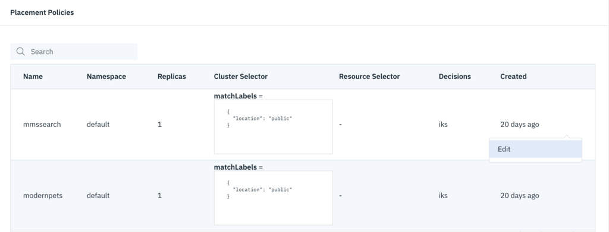
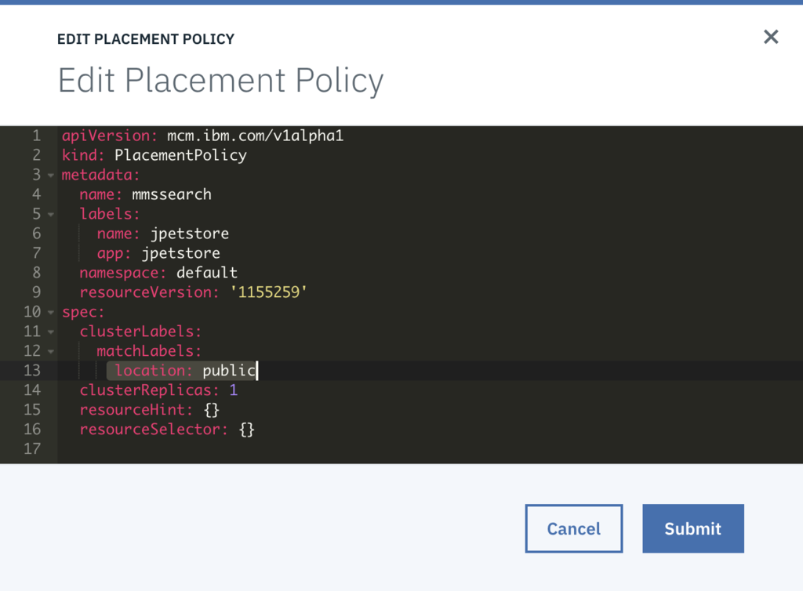
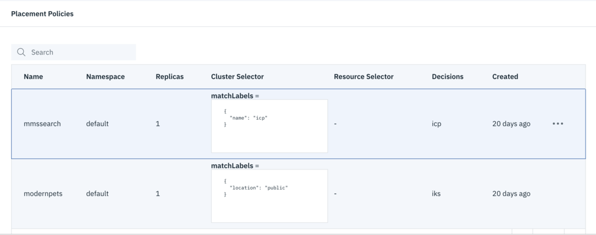

# How to develop and deploy an application using IBM MultiCloud Manager

This blog will discuss the step-by-step process of developing an application and deploying it to multiple clouds using IBM MultiCloud Manager.

### Start with an existing application
Start with a sample application on github
    git clone https://github.com/ibm-cloud/jpetstore-kubernetes
    cd jpetstore-kubernetes

We want to containerize this application so it can run on the cloud. To do this, we build a docker image for this application and then push it to the container registry

    docker build
    docker push

 Next, we need to create Helm charts for this application and push it to the ICP catalog/github

    helm create

 

## Defining the MCM application

A multi-cluster application uses the Kubernetes SIG Application CRD community specification, but with additional automation of the deployment and life-cycle management of resources to individual clusters.

#### Start with creating an application.yaml file
In any editor, create a file called application.yaml. We are going to populate it with the 5 components that are required to define an application in MCM - Application, Deployable, PlacementPolicy, ApplicationRelationship and PlacementBinding. 

We start with an empty template like the one shown below:

Now we populate each section of this application.yaml for our app.

**Labels**: The selector is used to match resources that belong to the Application. All of the applications resources should have labels such that they match this selector. Users should use theapp.kubernetes.io/name label on all components of the Application and set the selector to match this label. For instance, for our app, we are using {"matchLabels": [{"name": "jpetstore"}]} which will be used as the selector for this application, and each component should contain a label that matches this name.

**ComponentKinds** : This array of GroupKinds is used to indicate the types of resources that the application is composed of. As an example an Application that has a service and a deployment would set this field to[{"group":"core","kind": "Service"},{"group":"apps","kind":"Deployment"}]

##### Define the section for Deployable. 
A Deployable resource deploys your Helm chart.

Our app has two charts called `mssearch` and `modernpets`. This will create two separate Deployable resources so that MCM can deploy these two helm charts, based on the location specified in the `chartURL` parameter.

#### Define the PlacementPolicy. 
**PlacementPolicy** defines the criteria that MCM uses to find cluster(s) to place or deploy workloads. We can also define how many replicas we want to deploy. For instance, in our simple example below, we want to deploy one instance of both the deployables to the `public` cluster, so we define the PlacementPolicy as below. We can edit this later if needed.

#### Define the ApplicationRelationship 
**ApplicationRelationship** defines relationships among components inside Applications. For our application, the application `jpetstore` *contains* the two deployable resources. So we define the ApplicationRelationship as `type: contains` as shown below:

#### Define the PlacementBinding

Save this application.yaml file. 

## Creating an application in MCM
We can create the application in MCM either via the CLI or using the UI. 
Using CLI you simply have to do the following:

    kubectl create -f application.yaml

Using the UI, we go to Applications menu on the left hand main menu for MCM

Click on the "Create Application" button

Copy and paste the entire contents of the application.yaml file into the editor window that opens up and hit "Create Application"

 

That's it! You are done with defining and deploying your first application on IBM MultiCloud Manager!

Let's see all the resources that have been created from our application definition.

## Edit the PlacementPolicy and see it take effect

We can choose to edit the placementPolicy to say, to move one of the deployables to a different cluster. 

Hit `Submit` and you will see the changes take effect.

