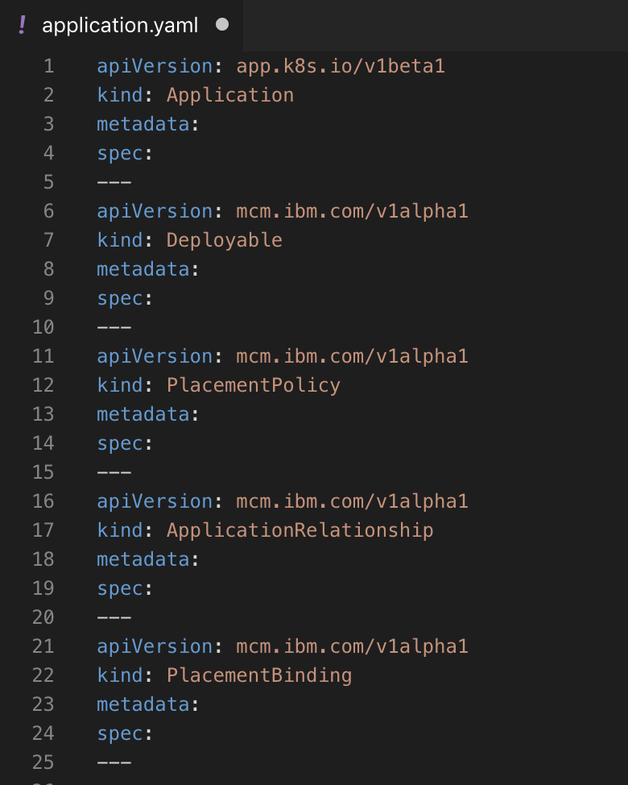
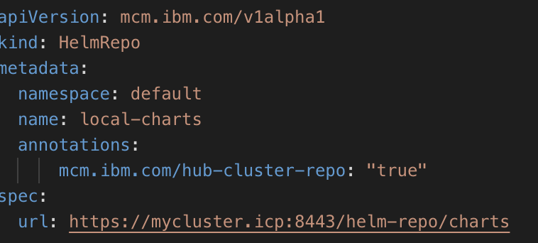

# How to create and deploy an application using IBM MultiCloud Manager

This blog will discuss the step-by-step process of creating an application and deploying it to multiple clouds using IBM MultiCloud Manager.

### Start with an existing application
Start with a sample application on github

    git clone https://github.com/ibm-cloud/jpetstore-kubernetes
    cd jpetstore-kubernetes

This sample perstore application consists of three parts - a `modernpets` and an `mssearch` component and a database.We want to containerize this application so it can run on the cloud. 

To do this, we build a docker image for all components of this application and then push it to the container registry under your namespace. In our example, we are pushing it to our ICP image registry under the `default` namespace.

    docker build . -t $(REGISTRY)/$(NAMESPACE)/jpetstoreweb
    docker push $(REGISTRY)/$(NAMESPACE)/jpetstoreweb
	cd jpetstore/db && docker build . -t $(REGISTRY)/$(NAMESPACE)/jpetstoredb
	docker push $(REGISTRY)/$(NAMESPACE)/jpetstoredb
    cd mmssearch && docker build . -t $(REGISTRY)/$(NAMESPACE)/mmssearch
	docker push $(REGISTRY)/$(NAMESPACE)/mmssearch

 Next, we need to create Helm charts for the components of this application:
    
    cd helm
    helm package ./modernpets
    helm package ./mmssearch

This will create two files in `*.tgz` format. We now push these charts to a repository that is accessible to remote clusters. This location will be referenced in the `chartURL` parameter in the application.yaml file that we define later on. We will push our charts to github.com.

`Please note:` You can also upload these charts to the local helm repository so that they show up in the catalog under `local-charts`.

    cd helm && helm install --name jpetstore ./modernpets
	cd helm && helm install --name mmssearch ./mmssearch

 

 If using the local chart for your helm chart, you need to specify a section in the `application.yaml` to define this. See section **Defining local chart repo** below for more details on this.

## Defining the MCM application

A multi-cluster application uses the Kubernetes SIG Application CRD community specification, but with additional automation of the deployment and life-cycle management of resources to individual clusters.

#### Start with creating an application.yaml file
In any editor, create a file called application.yaml. We are going to populate it with the 5 components that are required to define an application in MCM - Application, Deployable, PlacementPolicy, ApplicationRelationship and PlacementBinding. 

We start with an empty template like the one shown below and start filling each section:

Now we populate each section of this application.yaml for our app.

**Labels**: The selector is used to match resources that belong to the Application. All of the applications resources should have labels such that they match this selector. Users should use theapp.kubernetes.io/name label on all components of the Application and set the selector to match this label. For instance, for our app, we are using {"matchLabels": [{"name": "jpetstore"}]} which will be used as the selector for this application, and each component should contain a label that matches this name.

**ComponentKinds** : This array of GroupKinds is used to indicate the types of resources that the application is composed of. Our sample application  has a PlacementPolicy, so we define would set this field to[{"group":"mcm.ibm.com/v1alpha1","kind": "PlacementPolicy"}]

###Defining local chart repo
If the helm charts for the application are uploaded to the local repo, then we need to include a secion in the `application.yaml` to define this as follows

##### Define the section for Deployable. 
A Deployable resource deploys your Helm chart. Our app has two charts called `mssearch` and `modernpets`. This will create two separate Deployable resources so that MCM can deploy these two helm charts, based on the location specified in the `chartURL` parameter.

`Please note:` If the charts are in the local repo defined in the previous section, then the 

#### Define the PlacementPolicy. 
**PlacementPolicy** defines the criteria that MCM uses to find cluster(s) to place or deploy workloads. We can also define how many replicas we want to deploy. For instance, in our simple example below, we want to deploy one instance of both the deployables to the `public` cluster, so we define the PlacementPolicy as below. We can edit this later if needed.

#### Define the ApplicationRelationship 
**ApplicationRelationship** defines relationships among components inside Applications. For our application, the application `jpetstore` *contains* the two deployable resources. So we define the ApplicationRelationship as `type: contains` as shown below:

#### Define the PlacementBinding
**PlacementBinding** defines how to bind the PlacementPolicy rules to specific Deployables. So we define the PlacementBinding resource for each deployable and bind it with the correspinding PlacementPolicy as below:

Save this application.yaml file. 

## Creating an application in MCM
We can create the application in MCM either via the CLI or using the UI. 

Using CLI you simply have to do the following:

    kubectl create -f application.yaml

Using the UI, we go to Applications menu on the left hand main menu for MCM

Click on the "Create Application" button

Copy and paste the entire contents of the application.yaml file into the editor window that opens up and hit "Create Application"

 

That's it! You are done with defining and deploying your first application on IBM MultiCloud Manager!

Let's see all the resources that have been created from our application definition.

## Edit the PlacementPolicy and see it take effect

We can choose to edit the placementPolicy to say, to move one of the deployables to a different cluster or change the number of `clusterReplicas`. 

We change the `clusterLabels` to `{matchLabels: [{name: icp}]}`. 

Hit `Submit` and you will see the changes take effect.

As you can see, the `modernpets` deployable is now moved to the icp cluster. MCM uses other values, if specified in the yaml, like `resourceHint` or `compliance` to make a decision on which cluster to move the workload.

MCM uses Weavescope to display the topology of the application created. 

##Conclusion
So, in this tutorial, you saw how to create a simple `application.yaml` to create an MCM application and tell MCM where to get the helm charts from and where to deploy them. 

